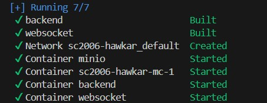
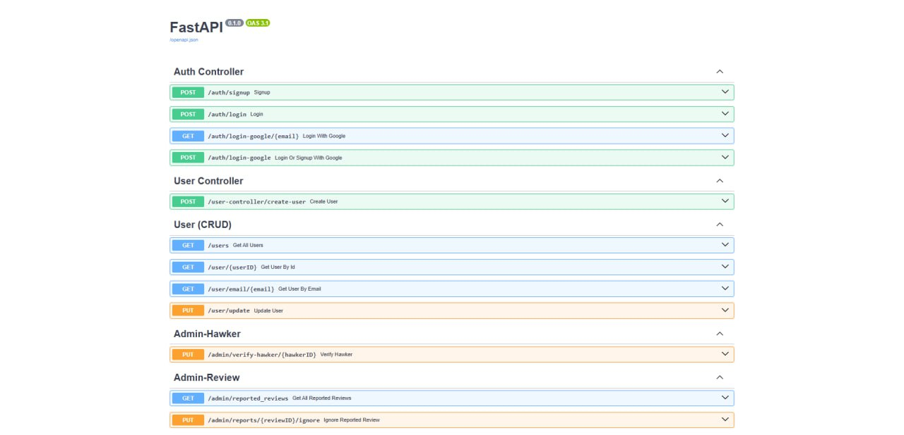
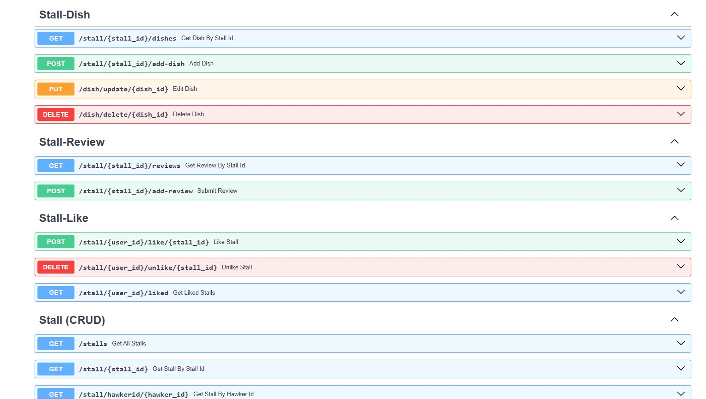
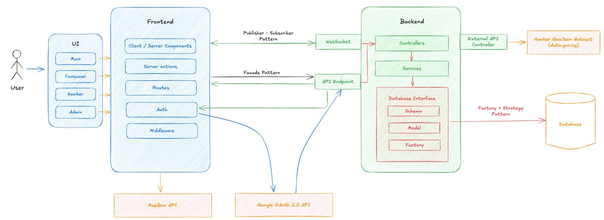

# SC2006-Hawkar  
---
As part of SC2006 Software Engineering Project, we will be developing **Hawkar** which is a web application designed to bridge the gap between hawkers and consumers. It enables hawkers to showcase their stalls and signature dishes, helping them gain visibility in the digital space. At the same time, consumers can explore hawker centers, discover new food options, and contribute reviews to share their dining experiences.

This will be the official readme document for the project. 

All icons used in this readme will be from either [Tandpfun on Github](https://github.com/tandpfun/skill-icons?tab=readme-ov-file#icons-list) or [icons8](https://icons8.com/icons) credits to their respective authors

---
# Table of Contents

## Setup Instructions

### Frontend

[Installing Nodejs](#installing-nodejs)
[Installing NPM](#installing-npm-node-package-manager)
[Running the frontend itself](#running-the-frontend-itself)

### Backend

[Installing Docker](#installing-docker-desktop)
[Running the Backend](#running-the-backend)

## Data seeding 

[Seeding](#seeding)

## Documentation

### APIs

[API Documentation](#api-documentation)
[API Endpoints](#api-endpoints)

### General design

[Overview](#overview)
[Frontend structure](#frontend-structure)
[Backend structure and design patterns](#backend-structure-and-design-patterns)

### Design Principles
[SOLID Pattern](#solid-pattern)

## Credits
[Tech Stack](#tech-stack)
[External APIs](#external-apis)
[Group Contributions](#group-contributions)


---

## Setup Instructions :wrench:

**Note** that the backend has to be up and running first **before** the frontend.

---
### Frontend

#### Installing Nodejs 
[](https://skillicons.dev)
In the command prompt, power shell or terminal, type in the following to see if Nodejs is already installed:
```bash
node -v
```
if a version number is returned, then it indicates that nodejs has already been installed on your computer.
```bash
v22.14.0
```
Should this not be the case, then please go to this following website(s) to learn how to install Nodejs for Windows and MacOS respectively

[Nodejs Windows installation tutorial](https://www.geeksforgeeks.org/install-node-js-on-windows/) 

[Nodejs MacOS installation](https://www.geeksforgeeks.org/how-to-install-nodejs-on-macos/) 

After installaion, run the above command once again to see if Nodejs has properly been installed. We reccomend using the installer directly for the installation of Nodejs.

---

#### Installing NPM (Node Package Manager) 
NPM should be included in the installation package of Nodejs by default, however, one should still verify its installation before setting up the frontend.
Enter the following command into the command prompt, power shell or terminal:
```bash
npm-v
```
Once again, if a version number is returned, then it indicates that NPM has been installed and you made now proceed on to running the frontend.
```bash
11.2.0
```
Should this not be the case, then you will have to install NPM manually, though this is rare, it can still happen for some, do go to the following [trouble shooting website for NPM](https://docs.npmjs.com/common-errors) if you happen to be one of the unfortunate ones.

---

#### Running the frontend itself 


Once you have verified the installation of Nodejs and NPM, you can now starting running the backend.

In the command prompt, powershell or terminal, set the directory to that of the frontend with the following command:
```bash
cd .....\SC2006-Hawkar\frontend
```
Once done, run the frontend with the following commands:

1. Install the frontend package on Nodejs:
    ```bash
    npm install
    ```
2. Run the frontend:
    ```bash
    npm run dev
    ```
3. On **Google Chrome**  (**we do not recommend other browsers** and it messes with the APIs), go to **http://localhost:3000/** to access the frontend and start using HAWKAR. :thumbsup:
   
---

### Backend

#### Installing Docker Desktop 


For ease of access and set up, we will be using Docker Engine to run the backend and other related services such as Minio (for image storage), Docker Engine is installed with Docker Desktop.

For the installation of docker desktop, please go to their [official website](https://docs.docker.com/desktop/) for more informaton. Do take note that Docker is **not supported** on some older Operating Systems.

Once installed, verify installation via executing the following commands in power shell, command prompt or terminal:
```bash
docker --version
```
 and
```bash
docker compose version
```
The former verifies the installation of Docker and the latter verifies the installation of docker compose which is paramount for the running of the Backend. Should the 2 programmes be properly installed, the version number should be returned:
```bash
Docker version 28.0.4, build b8034c0
```
for Docker and
```bash
Docker Compose version v2.34.0-desktop.1
```
for Docker Compose.

---

#### Running the Backend
 

Once Docker has been installed, run the backend as follows:
1. Run Docker deskstop and ensure that the Docker Engine is up and running.
2. In Terminal, power shell or a command prompt, change the directory to the main project folder:
   ```bash
   cd ...\...\SC2006-Hawkar
   ```
3. Build all of the requiremnt services via docker compose:
   ```bash
   docker compose up -d 
   ```
The messages returned will signify the backend startup process, only consider the backend up and running when all of the services have been built, as indicated when the system displays the following:



Once that is all done, run the [frontend](#running-the-frontend-itself) and you will be all set to start using our web application. You need not worry about the connection between the frontend and backend as it is already settled with the frontend environment being directed to the port of the backend server.

---

## Data seeding :office:

Note to delete any ```.db``` files in the app project folder before proceeding with data seeding to avoid errors.

### Seeding

The backend, upon execution, should automatically seed the backend database with a set of developer-predetermined data. Should you want to prevent this from happening, simply make comment line 20 in the ```.\backend\app\main.py```
```bash

# Seed database
# Uncomment the line below if you want to seed the database
add_event_listener_to_seed_database()   <--make comment this line here

```

The database seeded by the seeding process, aside from a full list of all the hawker centres in Singapore, will include the following (note that these tables are abridged):

#### Users seeded

| Name          | Email Address              | Role      |
|---------------|-----------------------------|-----------|
| Admin Jane    | admin1@gmail.com            | ADMIN     |
| Doggo         | admin2@gmail.com            | ADMIN     |
| John Consumer | john.consumer@example.com   | CONSUMER  |
| Alice Hawker  | alice.hawker@example.com    | HAWKER    |
| Bob Hawker    | bob.hawker@example.com      | HAWKER    |

#### Stalls seeded

| Stall ID | Stall Name       |
|----------|------------------|
| 7        | Alice's Delights |
| 8        | Bob's Gourmet    |

#### Dishes seeded

| Dish Name        | Stall Name       | Price |
|------------------|------------------|-------|
| Signature Special| Alice's Delights | 8.5   |
| Gourmet Burger   | Bob's Gourmet    | 12.9  |
| Premium Pasta    | Bob's Gourmet    | 14.9  |

---

## Documentation :books:

---

### APIs

#### API Documentation

Our web application utilizes FastAPI, which has an in-built documentation function for the created routes, attached below is a screenshot of the documentation, which can be found at https://sc2006-hawkar.onrender.com/docs, 

Note: The screenshots displays only some of the routes, for the full picture, please visit the website after the [backend](#running-the-backend-logo) is up and running to look at all the API routes




---

#### API Endpoints

Displayed in the FastAPI documentation, there are of 3 main categories: **Controllers**, **CRUD** and **others**:

1. **Controllers** Handles the vast majority of the business logic relating to sign-ups, login, edits, adding reviews, searching, etc. It is also resposible for converting the .json requests from the front end to pydantic schemas to be sent to the CRUD services for transfer into the database
2. **CRUD**  Whilst displayed in the FastAPI documentation, it, given how it works in the code and also the application design diagram, are not endpoint APIs, what they do is convert the pydantic model inputs from the controllers and convert them to an SQL model to be stored in the SQL database.
3. **Others** Other important functions that are outside the scope of the controller class, namely to handle admin reviews and approvals.
   
---

### General Design

#### Overview

Below will be the application design diagram, meant as a general overview of how our web application works:



*Credits to Zi Ting and Aliff*

---
#### Frontend Structure
There are 4 folders in the .\frontend folder, 2 of which being integral to the frontend infrastructure.

1. The ```app``` folder is essentially the User Interface and its subfolders all contain the User Interface and basic display and redirect logic for the functions available to the 3 roles of Consumer, Hawker and Admin.
2. The ```components``` contains both some UI design logic and all of the all important helper functions that sends requests to the backend and handles responses from the backend.
3. The ```middleware.ts``` file is essentially a file designed to protect that use case routes and to prevent Users with a different role from accessing the pages and functions meant for another or a user whose login instance cannot be verified.
4. The ```nextconfig.ts``` handles the business logic of uploading and retrieving photos from the **Minio** client.

---

#### Backend structure and design patterns

The .\backend\app folder, which holds the core infrastructure of the backend, holds, aside from the ```main.py```, 8 folders that are currently in use as core elements of the backend system as indicated in the design diagram.

1. The ```assets``` folder contains the seeding data and ```helper.py``` that seeds the data after starting up the backend. Including Geojson data and related image data.
2. The ```controllers``` folder, as suggested by the name of the folder, contain the various services classes that handles the vast majority of the backend business logic and serve as the vital endpoint APIs that both sends out responses to the user and handles requests by the user to the backend. They form the **facade pattern** that makes the application easy to use from the frontend by handling the frontend requests in the complex backend infrastructure and then returning a response that can be presented in a clean and simple manner.
3. The ```factory``` folder contains the classes responsible for the creation, initiation and definitions relating to the SQL database, SQL sessions and response models that the web application relies on to store data. It is the manifestation of the **Factory + Strategy Pattern** that we have utilized in the implementation of the database in our application.
4. The ```minio``` folder holds the default images that will be featured on the website upon start up, for these images will be first stored in the image hosting client **minio** for use by the website. Minio is also used to store user-uploaded images.
5. The ```models``` folder contains the SQL models and SQL table maps that is will be used to store data in the SQL database.
6. The ```routers``` folder contains the classes that calls in the controller classes in real time as the frontend sends requests to the backend. They are the ones instantiated and run in the main application file.
7. The ```schemas``` folder contains the input and response schematic models utilized by the controller classes, json messages from the frontend relating to database CRUD is converted into these schematic models which are then converted into SQL models for CRUD and responses from the CRUD is converted to these schematic models for later use as a response model for the frontend.
8. The ```services``` folder contains the CRUD classes, where schematic model inputs from the controller classes are converted to SQL models to be then inserted into the database. It also contains the classes that fetches search request result from the database to be sent out to the frontend by the controller classes.
9.  The ```websocket``` folder contains the handler function for the **websocket server** to serve as the information highway for the subscription and notifications system that we intend to develop in the future that will form the **Published-Subscriber Pattern** , currently still under development. 
10. The ```database.py``` file fetches the SQL sessions that is used by almost every class in the backend.

---

### Design Principles

#### The SOLID Principle

**Single Responsibility Principle** - Every class has a very specific set of functions dedicated solely to that particular aspect of the backend infrastructure, the controller classes do not deal with CRUD, the CRUD classes do not take in requests from the frontend and each control class is focussed on one specific role, the ```review.py``` classes do not for instance deal with searching, that is handled with the ```search.py```, simimlarly, the User control classes do not deal with functions specific to eac role

**Open-Closed Principle** - The Factory-Strategy and facade patterns enables the application to be open to extensions and upscaling, no modifications to the base is needed when new features are added.

**Liskov Substitution Principle** - The superclass **User** contains all of the common attributes found in its subclasses in the roles.

**Interface Segregation Principle** - Each class will only contain the functions that it absolutely needs and each function uses its own model for as much as possible, User Create and User Update for instance use different schematic models that do not include attributes that those respective functions do not needs.

**Dependency Inversion Principle** - Clealrly indicated in the ```database.py``` files in the ```.\backend\app\factory``` folder, instead of relying on one specific SQL database service, it is instead configured to use a SQL interface in general to allow for various SQL classes to be used, allowing for greater versatility.

---

## Credits :star2:

#### Tech Stack

External services and base software used in the application:

**Frontend**

1. TypeScript
2. NextConfig
3. Nodejs
4. Next.js

**Backend**

1. Minio 
2. Docker
3. Websocket
4. FastAPI

---

#### External APIs

1. [Google OAuth 2.0](https://developers.google.com/identity/protocols/oauth2)
2. [Government Hawker Geojson Datasheet](https://data.gov.sg/datasets/d_4a086da0a5553be1d89383cd90d07ecd/view)

---

#### Group Contributions

Credits to all the members of SC2006 ACDA2.

| Name     | Github   | Role     |
|----------|----------|----------|
|   Thant Thoo Aung |    [jack-thant](https://github.com/jack-thant)|     Team Leader and main developer for the frontend   |
|   NatthaKan Saeng-Nil  |   [Tanknam](https://github.com/Tanknam)       |   Main developer for Backend       |
|    Cao Junming   |    [newguyplaying](https://github.com/newguyplaying)      |   Backend and documentation      |
|  Muhammad Aliff Amirul Bin Mohammed Ariff |  [showtimezxc](https://github.com/showtimezxc)  |  Frontend and documentation   |
|    Kow Zi Ting      |     [HighlandK](https://github.com/HighlandK)     |     Frontend and documentation     |


     


   


